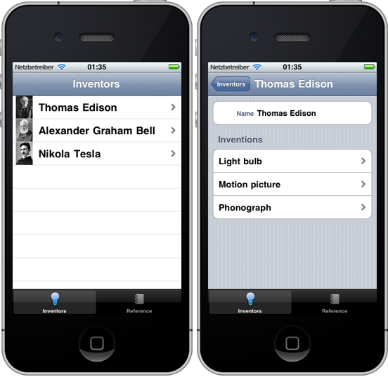
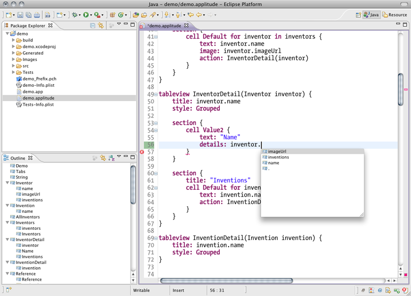
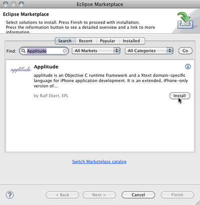
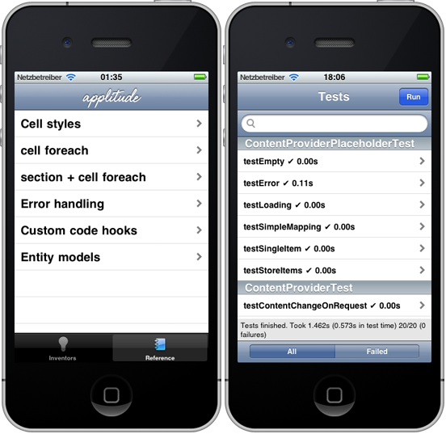
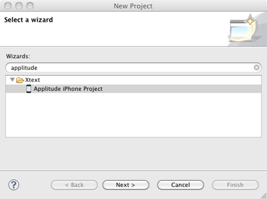
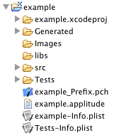
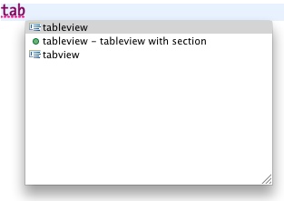
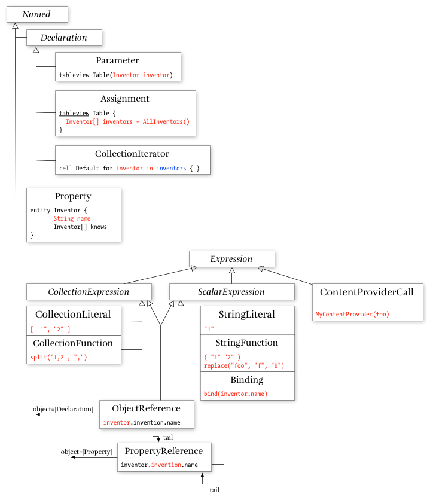

[GitHub](https://github.com/ralfebert/applitude/) |
[Issues](http://ralfebert.lighthouseapp.com/projects/67904/) |
[Installation](#installation)

# 

applitude is an Objective C runtime framework and a domain-specific language for iPhone application development. It is an extended, iPhone-only version of the [Applause](http://code.google.com/p/applause/) project.

## Overview

applitude comes with a domain specific language ("DSL") that allows to express frequently needed parts of iPhone applications in a very dense format. This language is made-to-measure to express iPhone apps, so instead of keywords like `if`, `then`, `while` it has keywords like `contentprovider`, `tableview`, `section` or `cell`.

For example, this application displays [JSON data](http://applitude.org/demo/inventors.json) about inventors loaded from an URL:

Written manually, you would have to care about many aspects like doing the HTTP requests, parsing the JSON data, showing activity indicators while the app is loading, feeding the data into tables when it gets available, responding to the `UITableViewDataSource` protocol, handling errors, caching the data, loading images in the background, navigating between the views and so on and on.

Instead, you could also write this [`demo.applitude`](https://github.com/ralfebert/applitude/blob/master/examples/demo/demo.applitude) document:


application Demo {
	view:Tabs()
}

tabview Tabs {
	tab {
		title: "Inventors"
		view: Inventors()
	}
}

type String mapsTo "NSString"

entity Inventor {
	String name
	String imageUrl
	Invention[] inventions
}

entity Invention {
	String name
}

contentprovider AllInventors returns Inventor[] fetches JSON from
	"http://applitude.org/demo/inventors.json" selects ""

tableview Inventors {
	Inventor[] inventors = AllInventors()

	title: "Inventors"

	section {
		cell Default for inventor in inventors {
			text: inventor.name
			image: inventor.imageUrl
			action: InventorDetail(inventor)
		}
	}
}

tableview InventorDetail(Inventor inventor) {
	title: inventor.name
	style: Grouped

	section {
		cell Value2 {
			text: "Name"
			details: inventor.name
		}
	}

	section {
		title: "Inventions"
		cell Default for invention in inventor.inventions {
			text: invention.name
		}
	}
}


You can edit this document in a convenient editor featuring code completion and instant error checking by installing the applitude plug-ins into the Eclipse IDE (these plug-ins are available because applitude's DSL is built using the marvelous [Xtext language development framework](http://www.eclipse.org/Xtext/)):

Then, as soon as you hit save, Objective C code is generated for `demo.applitude`. The generated code is small and tidied up by making use of runtime components wherever possible. Have a look at [InventorDetailViewController](https://github.com/ralfebert/applitude/blob/master/examples/demo/Generated/InventorDetailViewController.m) for an example of the kind of code generated for applitude apps.

Last but not least, the runtime components utilized by the generated code are not tied to the DSL at all and you can utilize them in hand-written code as well; the DSL just adds a very convenient layer on top. But why write boring code by hand if you can express it using a more appropriate language?

## Ok, where is the catch?

* You will need good knowledge of iPhone development in Objective C and some knowledge of building DSLs with Eclipse Xtext to enjoy Applitude.
* Currently, Applitude is intended as a tool for developers who like tinkering with own tools and languages. Please don't use Applitude if you don't feel comfortable with solving issues around such a tool yourself.
* Applitude is currently work in progress. Syntax and API might change, please check the [Release notes](#whatsnew) after installing new versions.

## Installation

* Get Eclipse IDE 3.6.1 from the [Eclipse download page](http://www.eclipse.org/downloads/) (it doesn't matter which package you choose, Eclipse IDE for Java Developers is fine)
* In Eclipse, click `Help > Eclipse Marketplace...`, choose the Eclipse Marketplace, search for "Applitude" and click `Install`:

    

    It might take some time to 'calculate requirements and dependencies'. You will be prompted to install unsigned content and to restart Eclipse.

    Alternatively, you can install Applitude from the p2 site `http://applitude.org/p2/` using `Help > Install New Software`.

* It is recommended to install the [Uncrustify code formatter](http://uncrustify.sourceforge.net/) because Applitude uses it to format the generated code. You can install it using [MacPorts](http://www.macports.org/) or [homebrew](http://mxcl.github.com/homebrew/). Applitude should find the binary automatically, you can also configure it from `Eclipse Preferences > Applitude > Generator`.
* Download the [applitude source zip](https://github.com/ralfebert/applitude/zipball/master) or clone the git repository:

		$ git clone git://github.com/ralfebert/applitude

## Running the demo example project

applitude comes with an example project at [`examples/demo/`](https://github.com/ralfebert/applitude/tree/master/examples/demo). It contains the Inventors example which fetches JSON content via HTTP:

It also contains a language reference and a [GHUnit](https://github.com/gabriel/gh-unit/) test suite (see the Tests target):

To run the demo project in Xcode:

* Open `demo.xcodeproj` in Xcode-
* Choose the target with `Run > Set Active Target`
* `Run > Debug`.

To edit `demo.applitude` in Eclipse:

* Import the demo project folder from `examples/demo/` using `File > Import > Existing Projects into workspace`.
* Open `demo.applitude` from the project root.
* Change something in demo.applitude and save it - the code under `Generated/` will be re-generated.

## Creating a new project

* Use `File > New > Project > Xtext > Applitude iPhone Project` in Eclipse to create a new Applitude project:

    

    This will create a new project containing a `.applitude` document for your application and an Xcode project:

	

* Open the `.applitude` file.
* Make sure the code was generated by checking files are present in the `Generated` folder (if not, try cleaning/building).
* You need to add the applitude runtime to the project folder. The wizard does not do this automatically because the setup varies. The generated Xcode project expects to see `libs/applitude/runtime/...` in the project folder. The easiest way is to copy the full applitude folder to `libs/` in your project. Alternatively, if you're using git to version your project, I recommend to use a submodule to setup your project like this:

		cd <project_folder>
		git init
		echo ".DS_Store build *.mode1v3 *.pbxuser *.perspectivev3 xcuserdata" | tr " " "\n" > .gitignore
		git add .
		git submodule add git://github.com/ralfebert/applitude.git libs/applitude/
		git commit -m "applitude project setup"

* Note: The wizard only adds the bare minimum of the runtime to the project. You need to manage these runtime folders manually in Xcode; as soon as you use more applitude features, you need to add additional runtime folders/classes. Also, if you update to newer versions of Applitude, the runtime structure might have changed.
* Open the project in Xcode, choose the target with `Run > Set Active Target` and do `Run > Debug`.

## Next steps

* I recommend to learn about Xtext DSLs by following the tutorial in the [Xtext Getting started documentation](http://www.eclipse.org/Xtext/documentation/).
* If you want to tinker with the DSL, install the `Xtext SDK` into your Eclipse IDE, clone the git repository and import the plug-in projects from the `tooling/` folder in Eclipse. Create a new Eclipse Application launch configuration, using the default settings to launch an Eclipse IDE instance running the imported workspace plug-ins.
* The best way to learn about applitude is to use it, adopting the projects to your needs, adding features to the DSL or the runtime libraries.

## Release Notes, What's new?

v0.3.0

* Wizard to create new projects including Xcode project, see `File > New > Project > Xtext > Applitude iPhone Project` in Eclipse ([#12](http://ralfebert.lighthouseapp.com/projects/67904-applitude/tickets/12)):

    

* Added template proposals for `for, cell, section, tableview` ([#31](http://ralfebert.lighthouseapp.com/projects/67904-applitude/tickets/31))

    

* `contentprovider ... selects [keyPath]`: `selects` is now optional and supported [#40](http://ralfebert.lighthouseapp.com/projects/67904-applitude/tickets/40)

* `contentprovider ... fetches XML` is now fully supported by runtime component `ContentProvider+XML`, added inventors demo reference example for JSON and XML [#51](http://ralfebert.lighthouseapp.com/projects/67904-applitude/tickets/51)

* Runtime classes were restructured ([#21](http://ralfebert.lighthouseapp.com/projects/67904-applitude/tickets/21), [#46](http://ralfebert.lighthouseapp.com/projects/67904-applitude/tickets/46)):
	* `/Laces -> /Bindings`
	* `/Laces/DateConverter.* -> /Utils/`
	* `/Laces/*Actions*.* -> /Actions/`
	* `/ContentProvider/UrlContentProvider.*`, `/ASIHTTPRequest -> /ContentProvider+URL/`
	* `JSONFilter`, `/TouchJSON -> /ContentProvider+JSON/`

v0.2.1 (2010-01-31)

* Changed file extension to `.applitude` (was `.app`)
* Added an example for custom controllers / actions to the demo app reference

## Reporting bugs

* If something is not working or not documented, please check if there is already a [ticket in the issue tracker](http://ralfebert.lighthouseapp.com/projects/67904). If not, please create a new one.
* Attaching a patch for the demo project or the tests that demonstrates the problem is very helpful.

## Contributing to Applitude

* Contributions to applitude under the Eclipse Public License (code) or the Creative Commons (documentation) are welcome.
* Just fork the project and send me a pull request on GitHub or [create a ticket](http://ralfebert.lighthouseapp.com/projects/67904) and attach a patch.
* I'll review every contribution within 3 business days.

## Support

* Please understand that, while I use applitude in my own commercial projects, most of the work on it is done in my free time. While I will answer questions by improving the documentation, I can not offer free support. Please don't use Applitude if you don't feel comfortable with solving issues around such a tool yourself.
* I can provide commercial support and development services for the project, provided that the resulting work is licensed under open source licenses. If you're interested in such services, send me a message on GitHub.

## FAQ

### Are apps containing generated code allowed on the app store?

There were restrictions in place for submitting apps created using 3rd party development tools, but they were relaxed in September 2010:

*"In particular, we are relaxing all restrictions on the development tools used to create iOS apps, as long as the resulting apps do not download any code."* [http://www.apple.com/pr/library/2010/09/09statement.html](http://www.apple.com/pr/library/2010/09/09statement.html)

The generated code and all runtime libraries only use official, public API. The generated code is just regular Objective C code which might as well have been written manually. Nothing can be guaranteed, but there are no issues known with submitting applitude apps to the app store.

## Appendix

### Expression Model Objects

## Licenses

applitude is licensed under the [Eclipse Public License v1.0](http://www.eclipse.org/legal/epl-v10.html).

Some runtime components have different licenses:

* ASIHTTPRequest, TouchXML, Reachability, parts of NSDate+Utils: BSD license
* TouchJSON, GHUnit, TextFieldCell: MIT license
* TTGlobalNetwork, UIView+Coordinates, parts of URLUtils: Apache License
* UIImage+Alpha/Resize/RoundedCorner: Other licenses

This document is licensed under 
